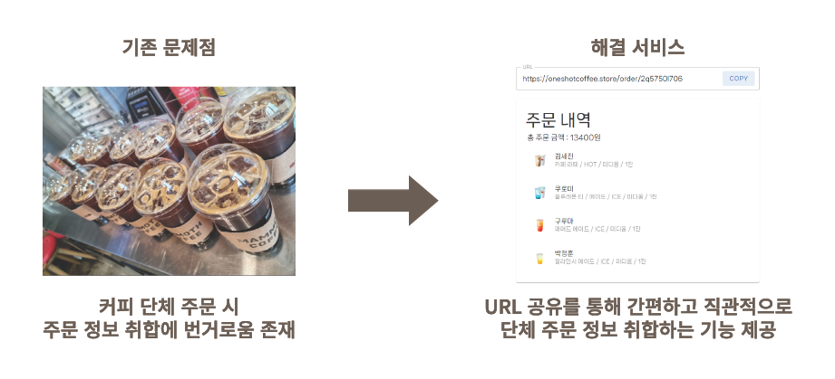
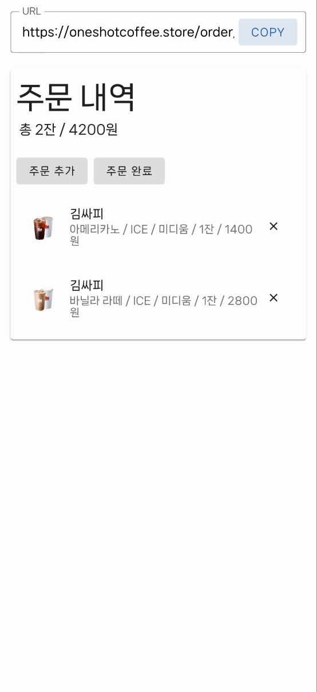

# ☕️ ONE-SHOT : 한번에 끝내는 커피 단체 주문

## 🎉 프로젝트 소개

## 👬 팀원 소개

| 박정훈 | 김세진 |
| :--: | :--: |
|  |  |
| 서버 구축 & 배포   데이터베이스   API 개발 | 프론트엔드   API 개발 |

## 📚 기술 스택

#### Front End
 

#### Back End

#### Database

#### Version Control
 

#### Infrastructure (AWS)

## 📝 API 명세서

- [User](https://github.com/nijesmik/ONE-SHOT/wiki/API-%E2%80%90-User)
- [Brand](https://github.com/nijesmik/ONE-SHOT/wiki/API-%E2%80%90-Brand)
- [Menu](https://github.com/nijesmik/ONE-SHOT/wiki/API-%E2%80%90-Menu)
- [MenuDetail](https://github.com/nijesmik/ONE-SHOT/wiki/API-%E2%80%90-MenuDetail)
- [Order](https://github.com/nijesmik/ONE-SHOT/wiki/API-%E2%80%90-Order)
- [OrderDetail](https://github.com/nijesmik/ONE-SHOT/wiki/API-%E2%80%90-OrderDetail)

## 📱 UI

| 주문서 생성 | 주문 추가 | 주문 삭제 |
| :-: | :-: | :-: |
|  |  |  |

## 🎸 기타

- [Flow Chart](https://github.com/nijesmik/ONE-SHOT/wiki/FlowChart)
- [ERD](https://github.com/nijesmik/ONE-SHOT/wiki/ERD)
- [Commit Convention](https://github.com/nijesmik/ONE-SHOT/wiki/Commit-Convention)
